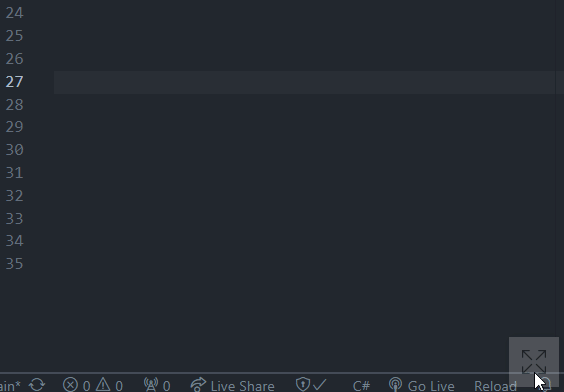

<h1 align="center">Quick Translation</h1>

<p align="center">
  
  
  
  
  
</p>

<p align="center">
  
</p>

---
	
DEMONSTRAÇÃO DE USO 🡾 |
:------------: |

<p align="center">
  
</p>

---

## Sumário

- [:dart: Objetivo](#dart-objetivo)
- [:rocket: Principais recursos](#rocket-principais-recursos)
- [:arrow_down: Como instalar](#arrow_down-como-instalar)
- [:computer: Como usar](#computer-como-usar)
- [:keyboard: Atalhos](#keyboard-atalhos)
- [:man_technologist: Modo DEV](#man_technologist-modo-dev)
   - [:clipboard: Listas com os tipos de formatações](#clipboard-listas-com-os-tipos-de-formatações)
      - [CSharp](#csharp)
      - [JavaScript](#javascript)
      - [Python](#python)
- [:wrench: Pré-requisitos](#wrench-pré-requisitos)
- [:gear: Como executar o projeto](#gear-como-executar-o-projeto)
- [:hammer_and_wrench: Tecnologias utilizadas](#hammer_and_wrench-tecnologias-utilizadas)
- [:scroll: Licença](#scroll-licença)
- [:pencil: Autor](#pencil-autor)
 
---

## :dart: Objetivo

O **Quick Translation** redefine a experiência de tradução de texto, tornando-a prática e rápida. 

Desenvolvido para facilitar o aprendizado de novos idiomas para qualquer pessoa interessada, o aplicativo oferece um modo DEV (desenvolvedor) especialmente projetado para desenvolvedores que desejam aprimorar seus códigos e aumentar sua fluência em um idioma específico de forma produtiva.

---

## :rocket: Principais recursos

- **Praticidade na tradução**: sempre à disposição durante suas tarefas com um simple clique ou atalho;
- **Interface intuitiva**: fácil de usar para usuários de todos os níveis;
- **Sobreposição**: praticidade na utilização com a possibilidade de fixar na frente de outros aplicativos;
- **Área de transferência automática**: cópia da tradução salva automaticamente na área de transferência para utilização em outros aplicativos;
- **Modo DEV**: tradução de nomes de variaveis, métodos, classes e muito mais com formatação para a sintaxe de uma linguagem de programação, simplificando a codificação.

---

## :arrow_down: Como instalar

Para instalar o aplicativo em seu computador siga as seguintes instruções:

1. No lado direito, dentro da seção **Releases**, clique na versão mais recente disponível (atualmente **v0.8.3-beta.2**).
   - Para instalar versões anteriores clique em **Releases** e selecione a versão que desejar.
2. Clique no arquivo executável (**.exe**) para baixá-lo.
   - Caso não encontre o arquivo [clique aqui](https://github.com/luishperna/electron-quick-translation/releases/download/v0.8.3-beta.2/QuickTranslation0.8.3-beta.2-Windows-Setup-0.8.3-beta.2.exe) para baixá-lo automaticamente.
3. Após baixado, navegue até o diretório onde o arquivo foi salvo (geralmente no diretório Downloads) e clique duas vezes sobre o arquivo.
4. O aplicativo será instalado automaticamente e, após a conclusão, será executado e estará pronto para a utilização.
   - Caso o Windows mostre uma mensagem de proteção, clique em **More info** e, em seguida, clique em **Run anyway** para permitir a execução do aplicativo.
   - Caso não execute automaticamente, procure por `Quick Translation` na barra de pesquisa do Windows e clique sobre o aplicativo.

_**Observação**: alguns textos podem variar dependendo do idioma configurado em seu computador._

## :computer: Como usar

Para usar o aplicativo siga as seguintes etapas:

1. Clique no ícone de expandir ou use o atalho `Ctrl` + `T` para maximizar o aplicativo, se estiver minimizado.
   - É possivel deixá-lo sempre maximizado clicando no ícone de alfinete.
2. Escolha os idiomas de origem e destino para a tradução.
3. Digite o texto que você deseja traduzir no campo apropriado.
   - É possivel inverter a tradução digitando o texto no campo do idioma de destino.
   - Se desejar usar o modo DEV, clique no ícone de engrenagem e, em seguida, selecionar o destino da formatação entre as linguagens de programação disponíveis.
4. Após digitar o texto, pressione a tecla `Enter`.
                                                                                              
Pronto! O texto traduzido será copiado automaticamente para sua área de transferência. Agora você pode colar onde desejar.

---

## :keyboard: Atalhos

Teclas         | Evento
:------------: | :------------:
`Tab`          | Navega entre os campos e botões do aplicativo
`Enter`        | Nos campos de texto realiza a tradução e nos demais campos realiza a ação de clique
`Ctrl` + `T`   | Maximiza ou minimiza o aplicativo
`Alt` + `Tab`  | Navega entre aplicativos (retorna ao ponto anterior do cursor após a tradução)

---

## :man_technologist: Modo DEV

Habilite o modo DEV digitando `.` (ponto) antes do texto para traduzir e o tipo de formatação como mostra no exemplo a seguir:

_Entrada ➔ PT-BR (CSharp)_
```
.ms obter todos os usuários 
```

_Saída ➔ EN-CA (CSharp)_
```cs
public string GetAllUsers()
{
	return ;
}
```

_**Observação**: após o tipo de formatação é necessário dar um espaço para digitar o texto._

### :clipboard: Listas com os tipos de formatações:

#### CSharp
Tipo de formatação       | Sintaxe de saída                           | Exemplo de saída _(EN-CA)_
:----------------------: | :----------------------------------------- | :----------------------  
`..`                     | Apenas o texto na sintaxe de uma variável  | `translatedText`
`.c`                     | Classe (público)                           | `public class TranslatedText {  }`
`.e`                     | Enumeração (público)                       | `public enum TranslatedText {  }`
`.i`                     | Interface (público)                        | `public interface ITranslatedText {  }`
`.m` ou `.mv`            | Método do tipo void (público)              | `public void TranslatedText() { return ; }`
`.mb`                    | Método do tipo bool (público)              | `public bool TranslatedText() { return ; }`
`.mc`                    | Método do tipo char (público)              | `public char TranslatedText() { return ; }`
`.md`                    | Método do tipo double (público)            | `public double TranslatedText() { return ; }`
`.mf`                    | Método do tipo float (público)             | `public float TranslatedText() { return ; }`
`.mi`                    | Método do tipo int (público)               | `public int TranslatedText() { return ; }`
`.ms`                    | Método do tipo string (público)            | `public tipo TranslatedText() { return ; }`
`.p` ou `.ps`            | Propriedade do tipo string                 | `public string TranslatedText { get; set; }`
`.pb`                    | Propriedade do tipo bool                   | `public bool TranslatedText { get; set; }`
`.pc`                    | Propriedade do tipo char                   | `public char TranslatedText { get; set; }`
`.pd`                    | Propriedade do tipo double                 | `public double TranslatedText { get; set; }`
`.pf`                    | Propriedade do tipo float                  | `public float TranslatedText { get; set; }`
`.pi`                    | Propriedade do tipo int                    | `public int TranslatedText { get; set; }`
`.v` ou `.vs`            | Variável do tipo string                    | `string translatedText = ;`
`.vb`                    | Variável do tipo bool                      | `bool translatedText = ;`
`.vc`                    | Variável do tipo char                      | `char translatedText = ;`
`.vd`                    | Variável do tipo double                    | `double translatedText = ;`
`.vf`                    | Variável do tipo float                     | `float translatedText = ;`
`.vi`                    | Variável do tipo int                       | `int translatedText = ;`

#### JavaScript
Tipo de formatação       | Sintaxe de saída                           | Exemplo de saída _(EN-CA)_
:----------------------: | :----------------------------------------- | :----------------------
`..`                     | Apenas o texto na sintaxe de uma variável  | `translatedText`
`.c`                     | Classe                                     | `class TranslatedText {  }`
`.f`                     | Método sem retorno                         | `function translatedText() {  }`
`.f(qualquer_caractere)` | Método com retorno                         | `function translatedText() { return ; }`
`.v`                     | Variável                                   | `var translatedText = ;`

#### Python
Tipo de formatação       | Sintaxe de saída                           | Exemplo de saída _(EN-CA)_
:----------------------: | :----------------------------------------- | :----------------------
`..`                     | Apenas o texto na sintaxe de uma variável  | `translated_text`
`.c`                     | Classe                                     | `class TranslatedText:`
`.f`                     | Método sem retorno                         | `def translated_text():`
`.f(qualquer_caractere)` | Método com retorno                         | `def translated_text(): return`
`.v`                     | Variável                                   | `translated_text =`

---

## :wrench: Pré-requisitos

- [x] Sistema operacional Windows;
- [x] Conexão com internet.

---

## :gear: Como executar o projeto

Execute o **Quick Translation** em sua máquina local com os seguintes passos:

1. Instale o **Node.js** em sua máquina.
   - Disponível em: https://nodejs.org/en.
2. Clone o projeto para o diretório que desejar executando o seguinte comando via terminal:
```
git clone https://github.com/luishperna/electron-quick-translation.git
```
3. Instale as dependências do projeto usando o comando: 
```
npm install
```
4. Execute o projeto com o comando abaixo:
```
npm run dev
```

O projeto será executado e estará pronto para realizar testes e/ou receber alterações em seu código-fonte.

## :hammer_and_wrench: Tecnologias utilizadas

- `HTML` `CSS` `JavaScript` `Electron` `Electron-builder` `MyMemory`

---

## :scroll: Licença

[**MIT License**](./LICENSE)

Copyright (c) 2023 Luís Henrique Perna

---

## :pencil: Autor

| [<br><sub>Luís Henrique Perna</sub>](https://github.com/luishperna) |
| :---: |